# Execution Plan

## Project: Tic-Tac-Toe Game

---

## Detailed Analysis Summary

### Project Overview
- **Project Type**: Greenfield (new project)
- **Technology Stack**: Vue.js 3 + Vite
- **Deployment**: Static web application (no backend)
- **Timeline**: Working version needed today

### Change Impact Assessment
| Impact Area | Applicable | Description |
|-------------|:----------:|-------------|
| User-facing changes | ✅ Yes | Complete new game UI |
| Structural changes | ❌ No | No existing structure to change |
| Data model changes | ❌ No | No database (client-side only) |
| API changes | ❌ No | No external APIs |
| NFR impact | ⚪ Minimal | Basic responsive design, no performance-critical requirements |

### Risk Assessment
- **Risk Level**: Low
- **Rollback Complexity**: N/A (greenfield)
- **Testing Complexity**: Simple (frontend-only, no integrations)

---

## Workflow Visualization

```mermaid
flowchart TD
    Start(["🎮 Tic-Tac-Toe Game"])
    
    subgraph INCEPTION["🔵 INCEPTION PHASE"]
        WD["✅ Workspace Detection<br/><b>COMPLETED</b>"]
        RA["✅ Requirements Analysis<br/><b>COMPLETED</b>"]
        US["✅ User Stories<br/><b>COMPLETED</b>"]
        WP["🔄 Workflow Planning<br/><b>IN PROGRESS</b>"]
        AD["⏭️ Application Design<br/><b>SKIP</b>"]
        UG["⏭️ Units Generation<br/><b>SKIP</b>"]
    end
    
    subgraph CONSTRUCTION["🟢 CONSTRUCTION PHASE"]
        FD["⏭️ Functional Design<br/><b>SKIP</b>"]
        NFR["⏭️ NFR Requirements<br/><b>SKIP</b>"]
        NFRD["⏭️ NFR Design<br/><b>SKIP</b>"]
        ID["⏭️ Infrastructure Design<br/><b>SKIP</b>"]
        CG["⏳ Code Generation<br/><b>EXECUTE</b>"]
        BT["⏳ Build and Test<br/><b>EXECUTE</b>"]
    end
    
    Start --> WD
    WD --> RA
    RA --> US
    US --> WP
    WP --> CG
    CG --> BT
    BT --> End(["🎉 Complete"])
    
    style WD fill:#4CAF50,stroke:#1B5E20,stroke-width:3px,color:#fff
    style RA fill:#4CAF50,stroke:#1B5E20,stroke-width:3px,color:#fff
    style US fill:#4CAF50,stroke:#1B5E20,stroke-width:3px,color:#fff
    style WP fill:#FFA726,stroke:#E65100,stroke-width:3px,color:#000
    style AD fill:#BDBDBD,stroke:#424242,stroke-width:2px,stroke-dasharray: 5 5,color:#000
    style UG fill:#BDBDBD,stroke:#424242,stroke-width:2px,stroke-dasharray: 5 5,color:#000
    style FD fill:#BDBDBD,stroke:#424242,stroke-width:2px,stroke-dasharray: 5 5,color:#000
    style NFR fill:#BDBDBD,stroke:#424242,stroke-width:2px,stroke-dasharray: 5 5,color:#000
    style NFRD fill:#BDBDBD,stroke:#424242,stroke-width:2px,stroke-dasharray: 5 5,color:#000
    style ID fill:#BDBDBD,stroke:#424242,stroke-width:2px,stroke-dasharray: 5 5,color:#000
    style CG fill:#2196F3,stroke:#0D47A1,stroke-width:3px,color:#fff
    style BT fill:#2196F3,stroke:#0D47A1,stroke-width:3px,color:#fff
    style Start fill:#CE93D8,stroke:#6A1B9A,stroke-width:3px,color:#000
    style End fill:#CE93D8,stroke:#6A1B9A,stroke-width:3px,color:#000
    
    linkStyle default stroke:#333,stroke-width:2px
```

---

## Phases to Execute

### 🔵 INCEPTION PHASE

| Stage | Status | Rationale |
|-------|--------|-----------|
| Workspace Detection | ✅ COMPLETED | Identified greenfield project |
| Reverse Engineering | ⏭️ SKIPPED | Not needed (greenfield) |
| Requirements Analysis | ✅ COMPLETED | 7 functional + 5 non-functional requirements defined |
| User Stories | ✅ COMPLETED | 26 user stories across 6 sections |
| Workflow Planning | 🔄 IN PROGRESS | Creating execution plan |
| Application Design | ⏭️ SKIP | Simple single-page game; component structure is straightforward |
| Units Generation | ⏭️ SKIP | Single unit (frontend game only); no decomposition needed |

### 🟢 CONSTRUCTION PHASE

| Stage | Status | Rationale |
|-------|--------|-----------|
| Functional Design | ⏭️ SKIP | Game logic (win detection, AI) is well-documented in requirements; no complex business rules |
| NFR Requirements | ⏭️ SKIP | Basic responsive design covered in requirements; no special performance/security needs |
| NFR Design | ⏭️ SKIP | NFR Requirements skipped |
| Infrastructure Design | ⏭️ SKIP | Static web app; no cloud infrastructure needed |
| Code Generation | ⏳ EXECUTE | **Primary deliverable** - Generate complete Vue.js game |
| Build and Test | ⏳ EXECUTE | Build, test, and verify the game works |

### 🟡 OPERATIONS PHASE

| Stage | Status | Rationale |
|-------|--------|-----------|
| Operations | ⏭️ PLACEHOLDER | Future expansion; not applicable for this project |

---

## Execution Summary

### Stages to Execute (2 remaining)
1. **Code Generation** - Generate complete Vue.js Tic-Tac-Toe game with all features
2. **Build and Test** - Verify game works correctly

### Stages Skipped (6 stages)
1. **Application Design** - Simple game structure
2. **Units Generation** - Single frontend unit
3. **Functional Design** - Logic well-defined in requirements
4. **NFR Requirements** - No special NFR needs
5. **NFR Design** - NFR Requirements skipped
6. **Infrastructure Design** - No cloud infrastructure

---

## Code Generation Scope

Based on requirements and user stories, Code Generation will produce:

### Core Files
- Vue.js project structure (Vite)
- Main game component
- Game board component
- AI logic module (Easy, Medium, Hard)
- Score tracking component
- Game history component

### Features to Implement
| Priority | Feature | Stories |
|----------|---------|---------|
| 🔴 P1 | Game board & mechanics | US-001 to US-006 |
| 🔴 P1 | Single player mode + AI | US-010 to US-014 |
| 🔴 P1 | Two player mode | US-020, US-022 |
| 🔴 P1 | Responsive design | US-053 |
| 🔴 P1 | Retro pixel art theme | US-054 |
| 🟡 P2 | Player names | US-021 |
| 🟡 P2 | Score tracking | US-030, US-031 |
| 🟡 P2 | Game history | US-040, US-041 |
| 🟡 P2 | Animations | US-050 |
| 🟡 P2 | Sound effects | US-051 |
| 🟢 P3 | Score reset | US-032 |
| 🟢 P3 | History navigation | US-042 |
| 🟢 P3 | Sound toggle | US-052 |

---

## Estimated Timeline

| Phase | Stage | Estimated Time |
|-------|-------|----------------|
| INCEPTION | Workflow Planning | ✅ Now |
| CONSTRUCTION | Code Generation | ~30-45 min |
| CONSTRUCTION | Build and Test | ~10-15 min |
| **Total** | | **~45-60 min** |

---

## Success Criteria

### Primary Goal
Deliver a working Tic-Tac-Toe game with:
- ✅ Single player mode (3 AI difficulties)
- ✅ Two player local mode
- ✅ Retro pixel art design
- ✅ Responsive layout
- ✅ Core game features (score, history, sounds, animations)

### Key Deliverables
1. Complete Vue.js project structure
2. Functional game with all modes
3. AI opponents (Easy, Medium, Hard)
4. Pixel art visual theme
5. Build and run instructions

### Quality Gates
- [ ] Game loads without errors
- [ ] All game modes playable
- [ ] Win/Draw detection works correctly
- [ ] AI responds appropriately per difficulty
- [ ] Responsive on mobile and desktop

